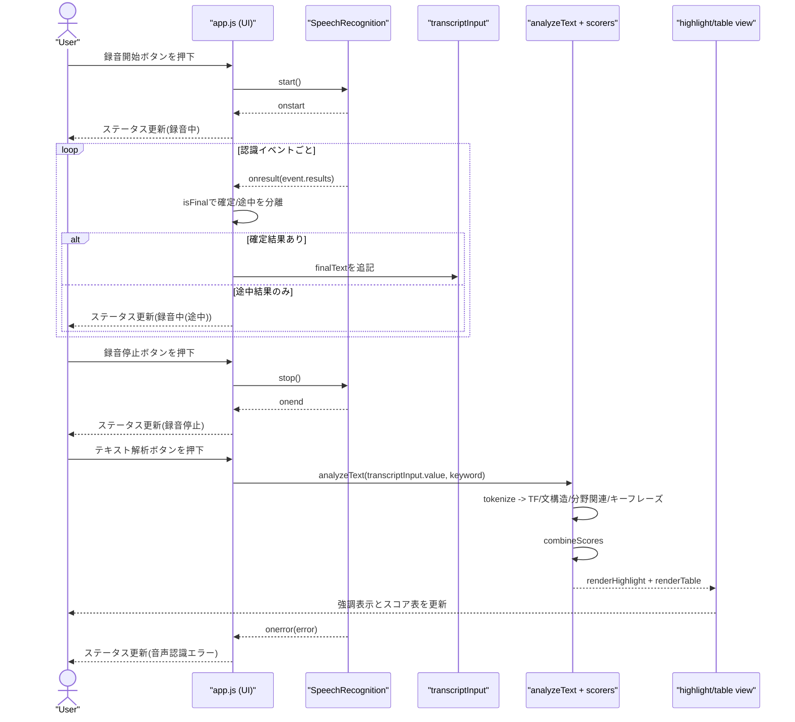

# Transcript Focus Lab (Frontend Prototype)

文字起こしテキストから重要語を重み付けし、強調表示するフロントエンド完結の試作です。

## 使い方

1. `index.html` をブラウザで開く
2. `録音開始` で文字起こし、またはテキストを直接入力
3. `分野キーワード`（カンマ区切り可）を指定
4. `TF-IDF を使う` チェックをON/OFFして `テキスト解析`（比較可能）

## Web Speech API入力の処理フロー

`app.js` では、Web Speech APIから受け取った入力を次の順で処理しています。

1. 初期化 (`setupSpeechRecognition`)
`window.SpeechRecognition || window.webkitSpeechRecognition` でAPIを取得し、以下を設定します。
`recognition.lang = langSelect.value`
`recognition.continuous = true` (連続認識)
`recognition.interimResults = true` (途中結果を受け取る)

2. 録音開始 (`startBtn` click)
`recognition.start()` を呼びます。`onstart` でUI状態を更新し、開始ボタンを無効化・停止ボタンを有効化します。

3. 音声結果受信 (`recognition.onresult`)
`event.results` を `event.resultIndex` から走査し、以下に分離します。
`isFinal === true` の結果は `finalText` に連結します。
`isFinal === false` の結果は `interimText` に連結します。

4. テキストエリアへの反映
`finalText` があるときだけ、`transcriptInput.value = \`${transcriptInput.value} ${finalText}\`.trim()` で追記します。
`interimText` は保存せず、ステータス表示 (`録音中(途中): ...`) のみに使います。

5. 録音停止 (`stopBtn` click / `onend`)
`recognition.stop()` を呼び、`onend` でUI状態を戻します（開始ボタン有効化、停止ボタン無効化）。

6. 解析実行 (`analyzeBtn` click)
録音で蓄積された `transcriptInput.value` を `analyzeText()` に渡して解析します。
内部では `tokenize -> TF/文構造/キーフレーズ/分野関連 -> combineScores -> 強調表示/表描画` の順で処理します。

7. エラー処理 (`recognition.onerror`)
`event.error` をステータスに表示して、失敗理由を確認できるようにしています。

## Web Speech API入力のシーケンス図

## 重み付けロジック

- `TF / TF-IDF`:
  - `TF`: 文中での相対出現回数
  - `TF-IDF`: 文をミニ文書として扱う sentence-based IDF を掛けた重み
- `文構造`:  
  - 日本語: 助詞ヒューリスティクス（`は/が` を主語寄り、`を/に/へ` を目的語寄りで加点）
  - 英語: 品詞・語順ヒューリスティクス（名詞 + 動詞位置）
- `分野関連`:  
  - キーワードとの語彙類似（完全一致・包含・文字n-gram類似）
  - ドメイン語彙の出現ドメイン数による重み付け（一般語の過大評価を抑制）
  - 同一文内での共起ブースト
  - 英語/英数字中心の語では Universal Sentence Encoder 類似度も補助的に利用
  - 最後にシグモイドで飽和を抑えて連続値化
- `キーフレーズ`:  
  - 日本語: 句境界（助詞・句読点）で分割した2-5語フレーズを抽出して加点
  - 英語: `Adjective* + Noun+` パターンを2-5語で抽出して加点
  - フレーズ長・フレーズ頻度・隣接ペア共起で段階スコア化

総合スコア:

`(0.34*TF + 0.22*文構造 + 0.34*分野関連 + 0.10*キーフレーズ) * (0.35 + 0.65*分野関連)`

分野関連スコアが低い語は総合スコアが抑制され、分野に近い語が上位に出やすくなります。

## 補足

- 音声認識は Web Speech API を使うため、Chrome 系ブラウザ推奨です。
- 完全な係り受け解析ではなく、文構造スコアはヒューリスティクスです。
- 本格運用する場合は、日本語なら Sudachi/Kuromoji + 係り受け解析器への置換が有効です。

## モジュール構成

- `app.js`: UI制御と解析フローの統合
- `modules/config.js`: 重み係数・ストップワード設定
- `modules/text-utils.js`: 正規化・トークン化・文分割
- `modules/scorers/tf-scorer.js`: TF重み
- `modules/scorers/structure-scorer.js`: 文構造重み
- `modules/scorers/semantic-scorer.js`: 分野関連重み（語彙類似 + 共起 + 埋め込み補助）
- `modules/scorers/phrase-scorer.js`: キーフレーズ重み
- `modules/scorers/combine-scores.js`: 各重みの合成
