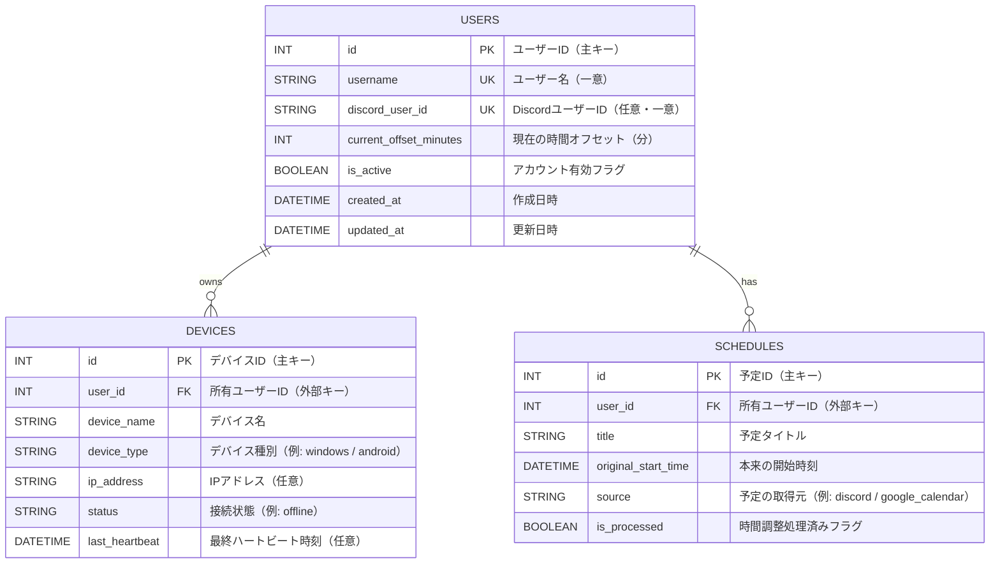

# Engineer Time Backend API
ハッカソンプロジェクト「エンジニア時間 (Engineer Time)」のバックエンドサーバーです。
ユーザーごとの時間のズレ（Offset）を管理し、予定に合わせてデバイスへ指令を出します。

### 🛠 前提条件
* Python 3.9 以上 がインストールされていること
* Git がインストールされていること

### 🚀 環境構築手順 (セットアップ)
* リポジトリをクローンした後、以下の手順で仮想環境を作成し、ライブラリをインストールしてください。

### 1. 仮想環境 (venv) の作成
backendディレクトリに移動
```
cd 2026_TEAM16/backend/
```

プロジェクトのフォルダ内でターミナル（またはコマンドプロンプト）を開き、OSに合わせて実行してください。

Mac / Linux / Raspberry Pi の場合:

``` Bash
python3 -m venv venv
```
Windows の場合:

```Bash
python -m venv venv
```

### 2. 仮想環境の有効化 (Activate)
仮想環境に入ります。コマンドラインの先頭に (venv) と表示されれば成功です。

Mac / Linux / Raspberry Pi の場合:

```Bash
source venv/bin/activate
```
Windows (コマンドプロンプト / cmd) の場合:

```Bash
venv\Scripts\activate
```
Windows (PowerShell) の場合:

```Bash
.\venv\Scripts\Activate.ps1
```

注意: PowerShellでセキュリティエラーが出る場合は、以下のコマンドを実行してから再試行してください:
`Set-ExecutionPolicy RemoteSigned -Scope Process`

### 3. ライブラリのインストール
必要なライブラリを一括でインストールします。(必ず仮想環境が有効になっている状態で行ってください)

```Bash
pip install -r ../requirements.txt
```
▶️ サーバーの起動方法
ローカル開発（自分だけがアクセスする場合）
以下のコマンドでAPIサーバーを起動します。コードを変更すると自動でリロードされます。

```Bash
uvicorn main:app --reload
```
`http://127.0.0.1:8000/docs`で起動します．

チーム開発・デモ本番（スマホやラズパイからアクセスする場合）
他のPCやスマホから接続できるようにするには、以下のコマンドを使います。

```Bash
uvicorn main:app --reload --host 0.0.0.0 --port 8000
```
起動後、サーバーPCのIPアドレスを使ってアクセスします。
例: http://192.168.1.15:8000/docs


## ER図



---

## テーブル定義（カラム説明付き）

### users

| カラム名 | 型 | 制約 | 説明 |
|---|---|---|---|
| id | Integer | PK | ユーザーを一意に識別するID |
| username | String | UNIQUE, INDEX | ログインや表示に使うユーザー名 |
| discord_user_id | String | UNIQUE, NULL可 | Discord連携時のユーザーID |
| current_offset_minutes | Integer | DEFAULT 0 | 現在適用中の時間のズレ（分単位） |
| is_active | Boolean | DEFAULT true | ユーザーが有効かどうか |
| created_at | DateTime(timezone=True) | server_default=now() | レコード作成日時 |
| updated_at | DateTime(timezone=True) | onupdate=now() | レコード更新日時 |

### devices

| カラム名 | 型 | 制約 | 説明 |
|---|---|---|---|
| id | Integer | PK | デバイスを一意に識別するID |
| user_id | Integer | FK(users.id) | このデバイスの所有ユーザーID |
| device_name | String |  | デバイス名（例: Living Room Clock） |
| device_type | String |  | デバイスの種類（例: windows, android） |
| ip_address | String | NULL可 | デバイスのIPアドレス |
| status | String | DEFAULT "offline" | デバイスのオンライン状態 |
| last_heartbeat | DateTime(timezone=True) | NULL可 | 最終疎通確認時刻 |

### schedules

| カラム名 | 型 | 制約 | 説明 |
|---|---|---|---|
| id | Integer | PK | 予定を一意に識別するID |
| user_id | Integer | FK(users.id) | この予定の所有ユーザーID |
| title | String |  | 予定のタイトル |
| original_start_time | DateTime |  | 本来の予定開始時刻 |
| source | String |  | 予定データの取得元 |
| is_processed | Boolean | DEFAULT false | 時間調整処理が済んだかどうか |

## リレーション

- users 1 : N devices（1ユーザーは複数デバイスを所有）
- users 1 : N schedules（1ユーザーは複数予定を持つ）